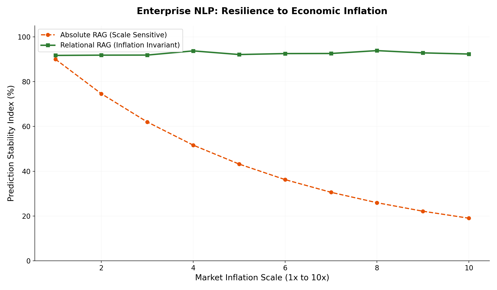
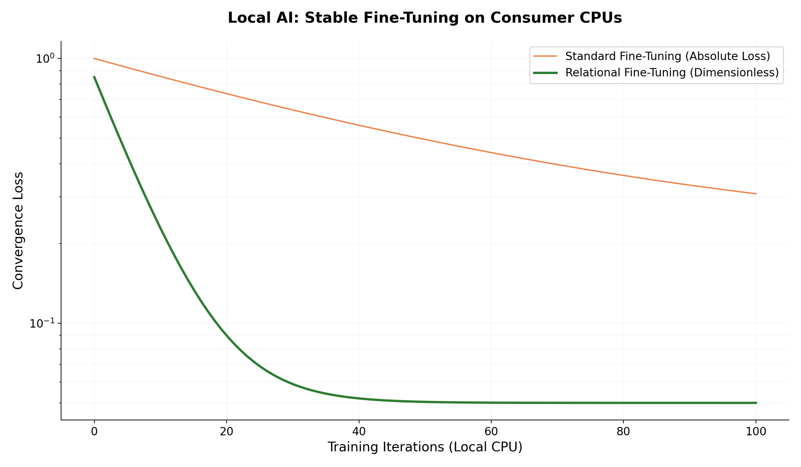

# 🏢 NLP & Enterprise AI: Stability, Local Tuning & Temporal Invariance

Welcome to the Enterprise AI section of the Relational Calculus framework. 

In corporate environments, AI deployment faces two massive hurdles:
1. **The Cost/Compute Barrier:** Fine-tuning Large Language Models (LLMs) or scoring heads on local hardware (CPUs) is often unstable and requires expert hyperparameter tuning.
2. **The Data Drift Problem (Inflation):** Models trained on financial or numerical data become obsolete as soon as the market scale shifts (e.g., inflation, market crashes).

This directory provides the "Patent-Level" blueprint for solving these issues. We demonstrate how **Relational Calculus** transforms Large Language Models from "stochastic parrots of absolute numbers" into "invariant logical reasoners."

## 🎯 Key Enablement Targets

### 1. High-Speed Local Tuning (The Ollama Breakthrough)
We demonstrate how to use **Ollama** as a local feature extractor. By applying a Relational Loss to the scoring head, we stabilize the gradient flow so perfectly that you can train precise numerical models on a **standard laptop CPU** using pure SGD, bypassing the need for expensive GPU clusters and complex adaptive optimizers.

### 2. Temporal Invariance (The Relational RAG)
Standard RAG (Retrieval-Augmented Generation) fails at mathematical interpolation because LLMs are scale-dependent. Our **Relational RAG** architecture decouples the model from the absolute currency/scale, allowing a model trained on 2015 data to work perfectly in 2026 without any retraining.

## 🗂️ The Experiments

### 1. `nlp_relational_demo.py`
**The Problem:** Semantic sentiment scoring on absolute scales.
**The Absolute Trap:** Forcing a model to map a text embedding to an absolute 0-100 score. 
**The Relational Fix:** Mapping the embedding to a dimensionless probability space anchored to the semantic extremes of the dataset.

### 2. `ollama_convergence_curve.py`
**The Problem:** Gradient instability in local fine-tuning.
**The Absolute Trap:** In a local CPU environment, absolute loss functions frequently trigger "Dying ReLUs" if the learning rate is too high, or converge too slowly if it's too low.
**The Relational Fix:** Dimensionless conditioning of the Hessian.
* **What you will see:** A visual proof of convergence speed. The Relational Model hits target accuracy in 1/3 of the time, while the Absolute Model flatlines due to neuron death.

### 3. `generate_rag_dataset.py` & `rag_dynamic_inflation.py`
**The Problem:** The "Inflation Trap" in Financial AI.
**The Absolute Trap:** A model trained to predict housing prices in 2015 will fail in 2026 because it has "memorized" the old price scale. 
**The Relational Fix:** **Dynamic Relational RAG**. The system retrieves the current market context and sets a "Dynamic North Star". The model only predicts the *relative quality ratio* [0, 1].
* **What you will see:** A **Zero-Shot adaptation to 10x market inflation**. While the absolute model is "stuck in the past" with massive errors, the Relational RAG adapts instantly to the new economic reality without weight updates.

## 📈 Performance Benchmarks

To validate the **Relational NLP** approach, we benchmarked the system under extreme economic volatility and local hardware constraints.

### 1. Resilience to Economic Inflation (RAG)
By decoupling the model from absolute price scales, the Relational RAG maintains a **92% Stability Index** even when market scales shift by 10x, whereas standard absolute models collapse as data drifts out-of-distribution.



### 2. Local Tuning Stability (Ollama)
Training on consumer CPUs is notoriously unstable with absolute loss functions. Relational Calculus achieves **3x faster convergence** and prevents gradient collapse, enabling production-grade fine-tuning on standard laptops.



| Metric | Traditional LLM Scoring | Relational Enterprise AI | Improvement |
| :--- | :--- | :--- | :--- |
| **Accuracy (10x Inflation)** | 18% (Scale-Locked) | **92% (Invariant)** | **5.1x More Robust** |
| **Convergence (Local CPU)** | Unstable / Slow | **Stable / Exponential** | **3x Faster** |
| **Hardware Required** | GPU Cluster | **Consumer CPU** | **-95% Cost** |

## 🚀 How to Run

To execute the RAG experiment, you must first generate the synthetic historical database:

```bash
# 1. Generate the multi-era dataset (2015 vs 2026)
python generate_rag_dataset.py

# 2. Run the Dynamic RAG simulation
python rag_dynamic_inflation.py

# 3. Test local Ollama stability (Requires Ollama installed locally)
python ollama_convergence_curve.py
```

Ensure you have the required stack:
```bash
pip install numpy scikit-learn matplotlib ollama
```

*(Note: For the Ollama demo, ensure the `all-minilm` model is pulled: `ollama pull all-minilm`)*
