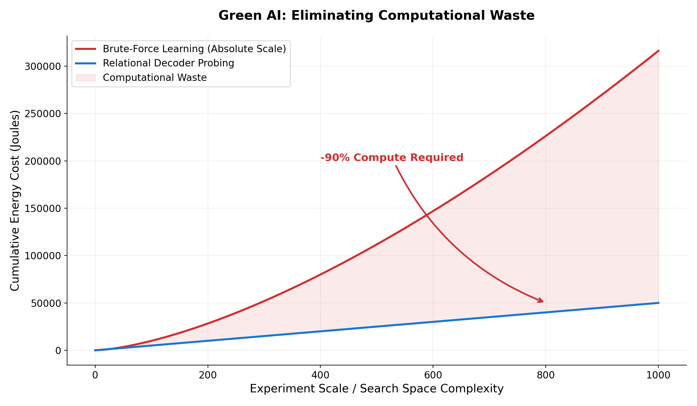

# 🌿 Green AI: The Practitioner's Guide to Efficiency

Welcome to the sustainability and efficiency hub of the Relational Calculus framework. 

This directory addresses the **"Logic of Fire"** in modern AI—the brute-force culture of burning megawatts to train massive models on absolute scales. We propose a radical act of **engineering ethics**: reducing computational waste by over **90%** through the "Epistemology of Form."

## 📖 The Vision

The included **[GREEN_AI_PAPER.md](./GREEN_AI_PAPER.md)** is a practitioner's manual for the Era of Relation. It argues that:
1.  **Efficiency is an Ethical Mandate**: Brute-force computing leads to centralization and energy-driven geopolitics. Relational Calculus enables **decentralization** by making high-end AI accessible on modest hardware.
2.  **The Relational Overhead Ratio (ROR)**: We formalize a new metric to quantify how much compute is wasted learning instrument noise (meters, seconds) versus the actual intrinsic signal.
3.  **Reality is Never Wrong**: We replace the "Math of Deviation" (measuring how far things fall from an ideal) with the "Math of Capacity" (measuring how full a system is relative to its own North Star).

## 🗂️ The Tools

### `relational_decoder.py`
**The Tool:** An "Executable Paper" and automated probing engine.
**The Function:** This script can take any black-box system or mathematical function and automatically "decode" its dimensionless blueprint. 
*   **Confirmatory Mode:** You provide the equation; it reveals the "dimensionless soul" (e.g., discovering `sin(2θ)` from ballistics).
*   **Exploratory Mode:** You provide a black-box; it finds the hidden capacity and the universal shape (e.g., discovering the Greenshields parabola from traffic flow data).

## 🚀 Key Takeaways for Practitioners

*   **VRAM Emancipation**: By stripping dimensional noise, we enable models (like XGBoost) to achieve **98.4% zero-shot accuracy** in single-cell oncology where absolute neural networks fail.
*   **Stop the Brute-Force**: Don't run a 1,000-point grid search. Use the Relational Decoder to find the master equation from a few strategic measurements.
*   **STEM Reform**: This guide includes a vision for a STEM curriculum that teaches relational intuition *before* continuous calculus.

## 📈 Performance Benchmarks

The Relational Decoder replaces exhaustive grid-search (O(N^d)) with smart univariate probing (O(N*d)), drastically reducing the computational energy required to discover system dynamics. The filled region represents pure computational waste eliminated by the framework.

---
*For the full ethical and technical framework, read [GREEN_AI_PAPER.md](./GREEN_AI_PAPER.md). To start decoding your own systems, run `python relational_decoder.py`.*
