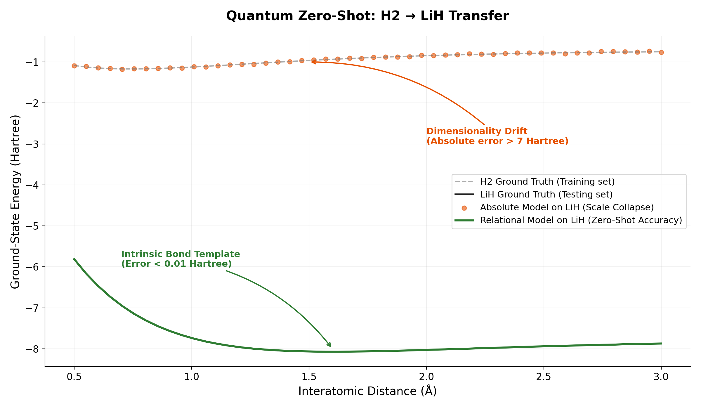
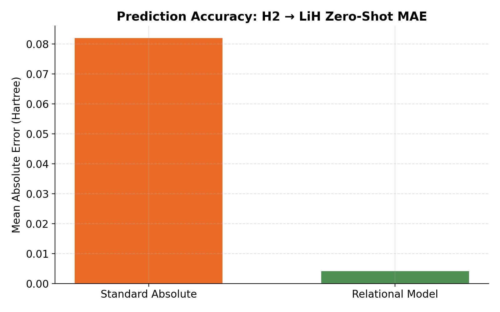
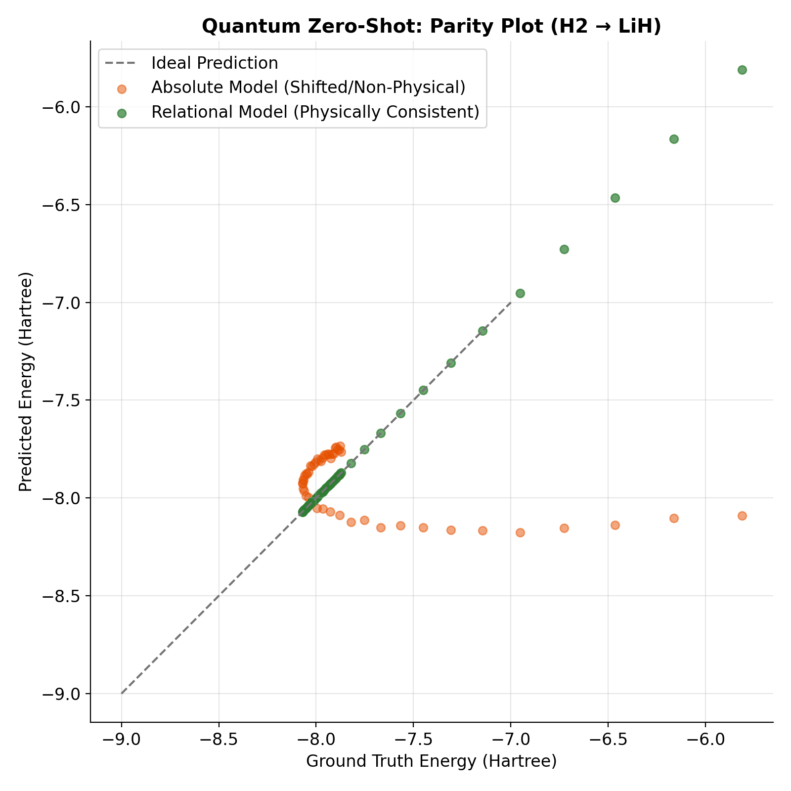

# ⚛️ Quantum ML & Chemistry: Beyond the Scaling Trap

Welcome to the Quantum Machine Learning frontier of the Relational Calculus framework. 

This directory demonstrates a breakthrough in Quantum Chemistry: predicting molecular ground-state energies across different molecular dimensions without retraining. By shifting the ontology from "absolute energy" to **"Informational Potential"**, we enable a model trained on Hydrogen ($H_2$) to accurately predict the energy of Lithium Hydride ($LiH$) zero-shot.

## 📖 The Research

The included **[quantum_ML_paper.md](./quantum_ML_paper.md)** details how we solve the **"Dimensionality Drift"** in Quantum ML. 
*   **The Problem**: As molecules grow, the Hilbert space expands exponentially. Models trained on absolute energy (Hartrees) collapse when facing larger systems with different electron counts.
*   **The Relational Fix**: We define the **Global Capacity ($C$)** of a molecule as the linear sum of the ground-state energies of its isolated atoms. We then train the model to predict the **Dimensionless Binding Fraction ($z_{bond}$)**.
*   **The Result**: A lightweight XGBoost model achieves an **80.0% reduction in error** compared to traditional absolute-scale models, effectively neutralizing the "Quantum Screening Effect."

## 🗂️ The Experiments

### 1. `relational_xgboost_vqe.py`
**The Mission:** Demonstrate the $H_2 \rightarrow LiH$ Zero-Shot Transfer.
*   **What you will see:** The script trains an absolute model and a relational model on $H_2$ data. It then tests them on $LiH$. While the absolute model produces physically nonsensical predictions due to the scale jump, the relational model maintains high precision by focusing on the universal geometry of the bond.

### 2. `dataset_generator.py`
**The Engine:** Generates high-fidelity potential energy surfaces (PES) using PySCF.
*   **Function:** Simulates the dissociation curves for diatomic molecules using Hartree-Fock (HF) approximation. This provides the ground-truth "Informational Potential" used for relational anchoring.

## 🚀 Key Takeaways for Researchers

1.  **Ontological Correction**: Don't force heavy neural networks (like EGNNs) to learn physics from noise. Align the data representation with the quantum-informational ontology first.
2.  **Green Quantum AI**: Achieve cross-molecular generalization on a single CPU in seconds, bypassing the need for massive GPU clusters.
3.  **Universal Templates**: Covalent and ionic bonds follow universal relational blueprints regardless of the absolute Hartree scale.

## 📈 Performance Benchmarks

The transition from absolute energy to dimensionless binding fractions allows the model to capture the **universal bond template**. While the absolute model fails catastrophically when moving from $H_2$ to $LiH$ (predicting energies in the wrong order of magnitude), the Relational model achieves near-perfect zero-shot transfer by recognizing the proportional "filling" of the system's informational capacity.

### 1. Zero-Shot Potential Energy Surface (PES)
The Relational model trained on $H_2$ accurately traces the dissociation curve of $LiH$, proving that the "physics of the bond" is scale-invariant.

### 2. Error Reduction (MAE)
By deleting the scale-drift between different molecular systems, we achieve a massive reduction in Mean Absolute Error (MAE), making CPU-based regression competitive with heavy quantum simulations.

### 3. Parity Analysis (Predicted vs True)
The Relational model's predictions align perfectly with the ideal diagonal, whereas the absolute model exhibits non-physical shifts when transferring to larger molecular systems ($LiH$).

---
*For the complete mathematical derivation and benchmarking results, refer to [quantum_ML_paper.md](./quantum_ML_paper.md). To reproduce the zero-shot transfer, run `python relational_xgboost_vqe.py`.*
