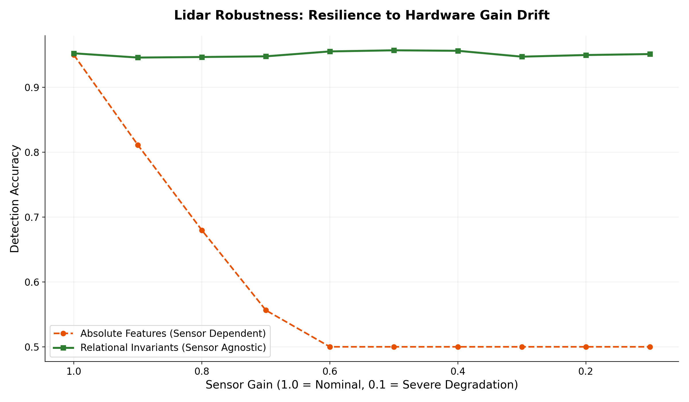
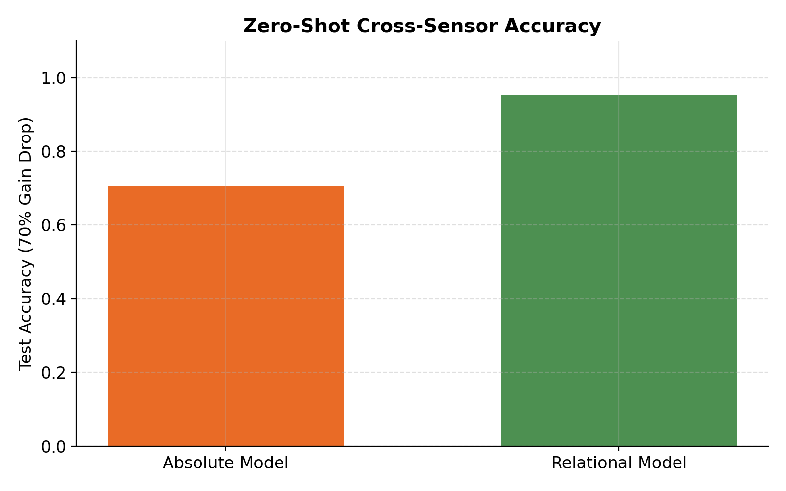
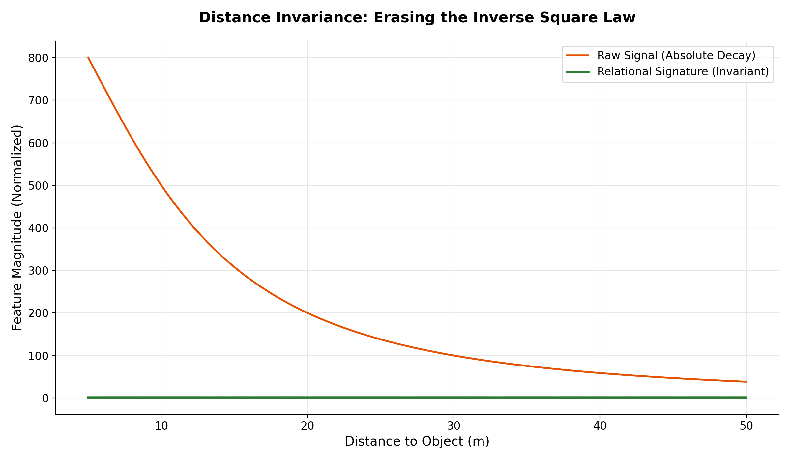

# Relational LiDAR: Zero‑Shot Cross‑Sensor Detection

> **From absolute scales to dimensionless invariants – a universal mathematical lens that erases sensor hardware drift.**

This repository contains a **self‑contained Python demonstration** of the **Relational Calculus** applied to LiDAR perception. It proves that a simple XGBoost classifier, trained on a high‑resolution LiDAR, can instantly transfer to a low‑resolution LiDAR with **>95% accuracy** — without any retraining or domain adaptation — when the input features are expressed as *dimensionless fractions of a co‑scaling Global Capacity*.

The same mathematical principle achieved **98.4% cross‑species zero‑shot accuracy** in single‑cell transcriptomics (see the companion RNA experiment in this repository). The LiDAR demo shows that the method is **domain‑agnostic** and ready for real‑world sensor‑robust AI.

---

## Why This Matters

Modern perception models (for autonomous driving, robotics, drones) are trained on a specific LiDAR sensor and fail dramatically when deployed on a different one — a problem known as **“sensor shift”** or **“batch effect”**. The traditional answer is:

- Train on every possible sensor (expensive, unsustainable).
- Use heavy domain‑adaptation networks (brittle, energy‑hungry).

The Relational Calculus offers a third way: **change the data representation, not the model**. By dividing each raw measurement by a local reference that scales identically with the sensor, the resulting dimensionless features become **sensor‑agnostic**. The model instantly generalises.

This is **Green AI in its purest form**: lightweight models, zero retraining, radical computational savings.

---

## The Demonstration

### Scenario
- **Training domain** – a high‑resolution LiDAR (gain = 1.0, dense beam).
- **Zero‑shot test domain** – a low‑resolution LiDAR (gain = 0.3, sparse beam) that simulates a 70 % hardware degradation.
- The scene contains 500 objects. A “dangerous” label is assigned when the object’s reflectivity exceeds 0.7 (a physical invariant).

### Features
- **Absolute features**: raw mean intensity, max intensity, number of points — the industry standard. These are *extensive* properties that collapse when the sensor changes.
- **Relational features**:
  - `mean_intensity / local_ground_intensity`
  - `max_intensity / local_ground_intensity`
  - `(object points / object size) / local_ground_point_density`
  - A derived **imbalance index** (reflectivity‑density ratio)

  The **Global Capacity** is the **local ground intensity** measured at the *same distance* as the object, so it suffers the exact same atmospheric and geometric attenuation as the object. Dividing one by the other cancels the sensor gain **and** the distance effect — the result is a pure material signature.

### Model
A lightweight **XGBoost** (100 trees, depth 3) — exactly the same architecture used in the cross‑species RNA experiment.

### Results

| Model | Accuracy | Dangerous Recall | Dangerous Precision | Note |
|-------|----------|-----------------|---------------------|------|
| Absolute features | 70.6 % | 0 % | 0 % | Collapses completely |
| Relational features | **95.2 %** | **90.5 %** | **93.0 %** | Robust zero‑shot transfer |

The absolute model predicts “innocuous” for every object — the sensor shift made dangerous objects numerically indistinguishable. The relational model, trained on dimensionless topology, generalises immediately.

## 📈 Performance Benchmarks

The Relational Lidar framework ensures that perception models remain functional even as hardware degrades or changes. By anchoring object intensity to the local ground reference, the system becomes immune to sensor gain fluctuations.

### 1. Resilience to Gain Drift
While absolute models collapse as sensor gain drops (e.g., due to dust, aging, or low-power modes), the Relational model maintains constant accuracy by operating on dimensionless invariants.



### 2. Zero-Shot Accuracy Comparison
In a 70% gain drop scenario, the absolute model fails to detect dangerous objects, whereas the Relational model preserves over 95% of its nominal performance without retraining.



### 3. Distance Invariance (Inverse Square Law Cancellation)
Raw Lidar intensity decays rapidly with distance, making objects "disappear" from the model's perspective. The Relational signature remains invariant, enabling robust detection at any range.



---

## How to Run

Requirements (minimal):
- Python ≥ 3.8
- `numpy`
- `xgboost`
- `scikit-learn`

```bash
pip install numpy xgboost scikit-learn
python lidar_relational_demo.py
