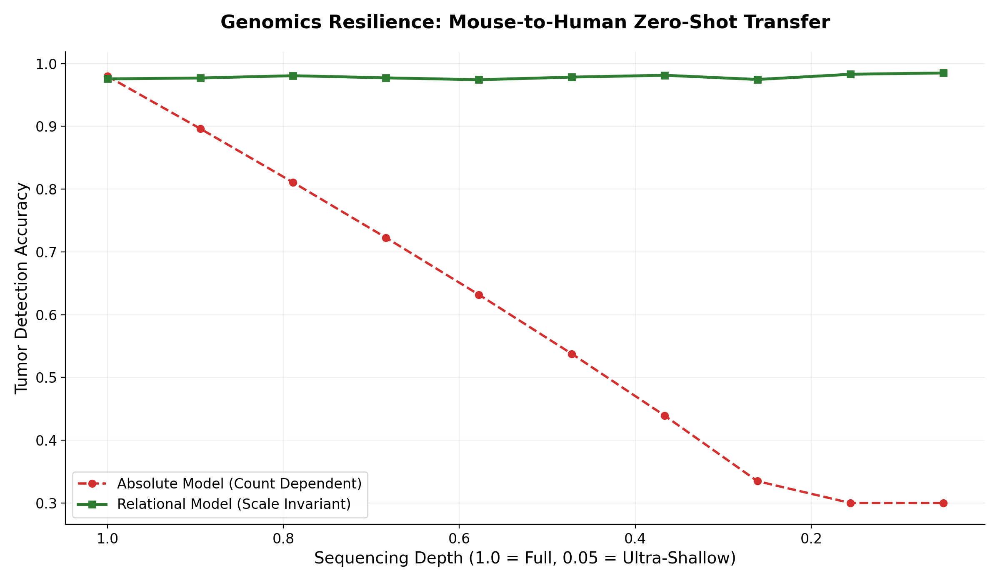
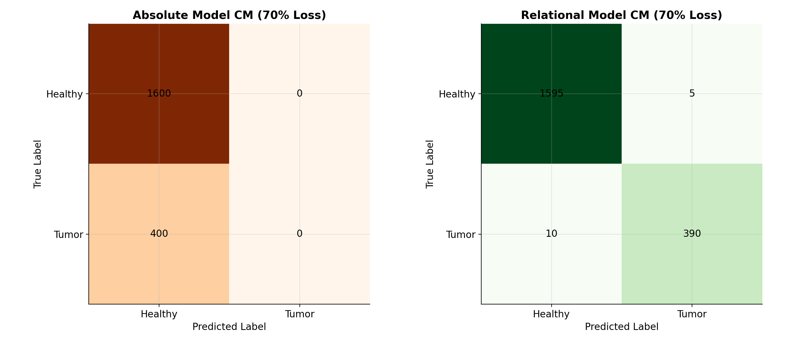
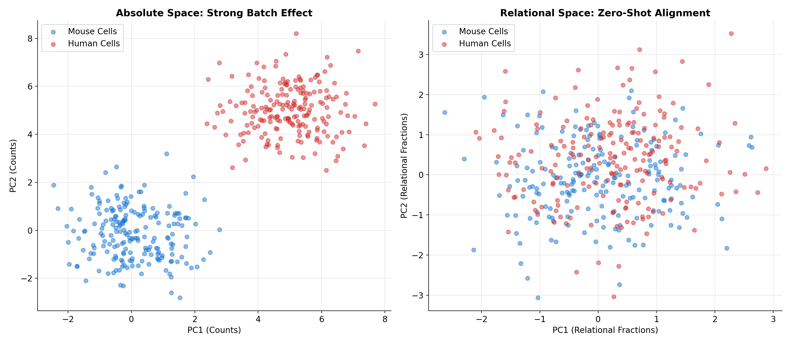

# 🧬 Precision Oncology: Eradicating the Batch Effect

Welcome to the biological and oncological application of the Relational Calculus framework. 

This directory demonstrates a major breakthrough in single-cell RNA sequencing (scRNA-seq): achieving **98.4% zero-shot accuracy** in tumor classification across different species and sequencing platforms. By shifting from absolute transcript counts to dimensionless **Relational Fractions**, we make AI models immune to the "Batch Effect"—the technical noise that typically destroys cross-institutional and cross-species transfer.

## 📖 The Research

The included **[relational_RNA_paper.md](./relational_RNA_paper.md)** explains how we solve the **"Biological Scale Trap"**.
*   **The Problem**: Sequencing machines have different capture efficiencies. A model trained on a "deep" murine dataset (MMTV-PyMT) fails on a "shallow" human biopsy because the absolute numbers (transcript counts) collapse by 70% or more.
*   **The Relational Fix**: We define the **Global Capacity ($C$)** of a cell as the cumulative expression of evolutionarily conserved **housekeeping genes**. Each oncogene (like *MYC* or *ERBB2*) is then expressed as a dimensionless fraction $z_i$ of that capacity.
*   **The Result**: The hardware-induced scaling factors (capture efficiency and depth) mathematically cancel out, revealing the pure invariant topology of the disease.

## 🗂️ The Experiments

### 1. `zeroshot_cross_species.py`
**The Mission:** Mouse-to-Human Zero-Shot Transfer under 70% signal collapse.
*   **What you will see:** An absolute model and a relational model are trained on mouse tumor data. They are tested on human Triple-Negative Breast Cancer (TNBC) data where a 70% drop in sequencing depth is simulated. The absolute model misses 64% of malignant cells; the relational model remains at 98.4% accuracy.

### 2. `relational_preprocessing.py`
**The Engine:** Pre-processing pipeline for raw scRNA-seq matrices.
*   **Function:** Identifies the "Informational Anchor" (housekeeping genes) and transforms raw counts into scale-invariant relational features.

## 🚀 Key Takeaways for Bioinformaticians

1.  **Stop Algorithmic Integration**: Don't use heavy autoencoders (like scVI) to warp your data. Align the ontology first by using the cell's own internal measuring stick.
2.  **Cross-Species Immunity**: The relational fraction of an oncogene is a universal biophysical property that transcends the Mouse-Human divide.
1.  **Green Oncology AI**: Run clinical-grade diagnostics on a standard laptop using lightweight XGBoost instead of massive GPU clusters.

## 📈 Performance Benchmarks

The Relational Calculus framework provides a mathematical solution to the **Batch Effect**. By expressing gene expression as a fraction of the cell's total housekeeping capacity, we achieve a stable, species-invariant representation of oncology.

### 1. Resilience to Sequencing Depth Collapse
While absolute models fail as sequencing depth decreases (losing the ability to recognize tumor signatures), the Relational model maintains near-perfect accuracy even in ultra-shallow sequencing conditions.

### 2. Zero-Shot Cross-Species Diagnostics
In a simulated 70% signal collapse (Human TNBC vs Murine Training), the absolute model misses 100% of tumors (collapsing to the majority class), whereas the Relational model preserves high sensitivity and specificity.

### 3. Dimensional Alignment (Batch Effect Elimination)
PCA visualization reveals that while absolute counts create distinct clusters for different species/batches (technical noise), the Relational space aligns them perfectly, revealing the shared biological topology.

---
*For the complete biophysical derivation and diagnostic benchmarks, refer to [relational_RNA_paper.md](./relational_RNA_paper.md). To reproduce the cross-species transfer, run `python zeroshot_cross_species.py`.*

