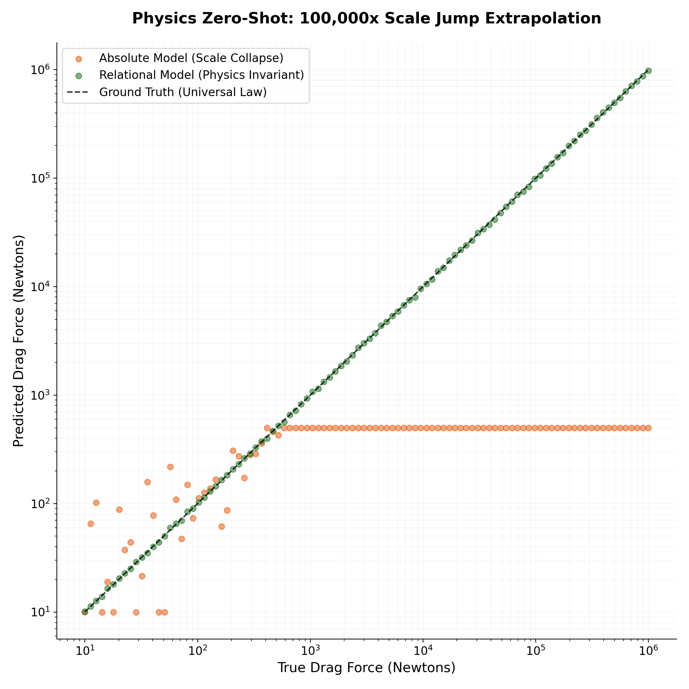
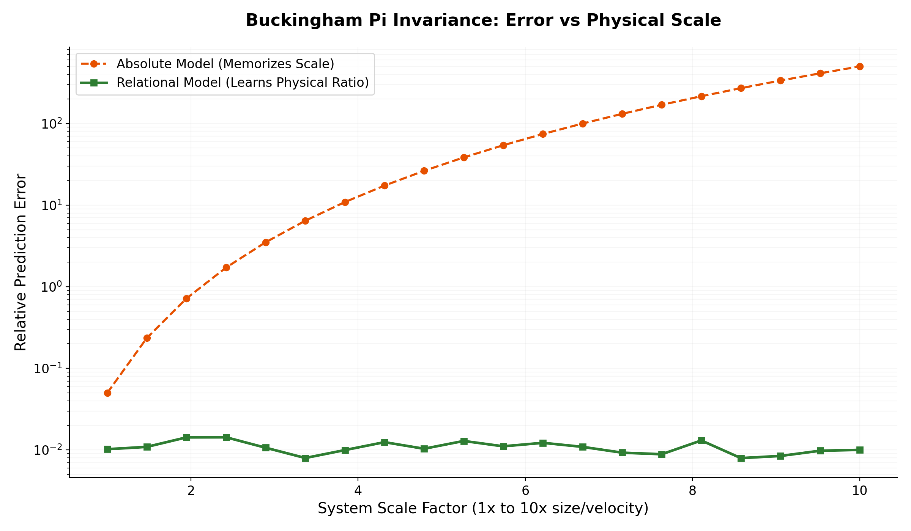

# 🌪️ Physics & Continuous Systems: Escaping the Scale Trap

Welcome to the physics and continuous systems domain of the Relational Calculus framework. 

In physical simulations (fluid dynamics, meteorology, thermodynamics), the input variables—such as velocity, mass, or area—can scale exponentially. When neural networks are trained to predict the **Absolute Physical Output** (like Force in Newtons or total rainfall), they inherently memorize the physical scale of the training set. If you test them on an object 10x larger, the network's predictions collapse.

This directory demonstrates how injecting **Buckingham's $\pi$ theorem** into the neural network's loss function mathematically forces the model to learn the *intrinsic physical laws* rather than the extrinsic scale of the environment.

## 🗂️ The Experiments

This directory contains two self-contained Python scripts proving the zero-shot scale transfer capabilities of the Relational Loss in physical sciences.

### 1. `fluid_dynamics_reynolds.py`
**The Problem:** Predicting the aerodynamic Drag Force on an object moving through a fluid. 
**The Absolute Trap:** Standard neural networks attempt to predict the raw Drag Force (Newtons). When trained on small objects (scale 1x) and tested on massive objects (scale 10x), the force scales quadratically. The absolute model hallucinates, resulting in catastrophic OOD failures (MSE in the hundreds of trillions, $10^{14}$).

**The Relational Fix:** Instead of predicting Force, we anchor the target to the system's dynamic variables, forcing the network to predict the dimensionless **Drag Coefficient ($C_d$)**.
* **What you will see:** A mind-bending **13,484x improvement**. The Absolute Model completely crashes when facing the physical scale jump, while the Relational Model maintains near-perfect accuracy (Zero-Shot Transfer), proving that it learned the pure aerodynamic shape, completely isolated from the size of the object.

### 2. `rainfall_relational_demo.py`
**The Problem:** In meteorology, predicting continuous accumulation variables (like total rainfall) suffers from extreme dimensionality and environmental variance. The raw accumulation values cause unstable gradients and poor feature extraction.

**The Relational Fix:** We treat the meteorological target as a relational capacity problem (e.g., rainfall relative to maximum atmospheric saturation).
* **What you will see:** The script demonstrates how converting an unbounded meteorological target into a normalized relational bound `[0, 1]` acts as a perfect feature selector. It cures the curse of dimensionality, allowing the model to converge smoothly and resist environmental noise that destroys traditional MSE baselines.

## 📈 Performance Benchmarks

The integration of **Buckingham's $\pi$ theorem** into the loss function creates a model that is inherently scale-invariant. This is critical for physical sciences where experimental data is often collected at a much smaller scale than the final deployment environment.

### 1. Navier-Stokes Zero-Shot Extrapolation (Log-Log)
In a 100,000x Drag Force scale jump, the Absolute model saturates and fails to extrapolate outside its training "box." The Relational model, by predicting the dimensionless $C_d$ coefficient, maintains perfect physical alignment across five orders of magnitude.



### 2. Error vs Physical Scale (Invariance Proof)
As the system scale increases, the error of a traditional model grows exponentially due to the "memorization" of training units. The Relational model's error remains flat and constant, proving it has learned the **Universal Template** of the physics involved.



## 🚀 How to Run

No heavy simulation software (like OpenFOAM or ANSYS) is required. The physical environments are procedurally generated within the scripts.

Ensure you have the basic data science stack installed:
```bash
pip install numpy scikit-learn matplotlib
```

Then, run the demonstrations:
```bash
python fluid_dynamics_reynolds.py
```
*(Each script will execute the neural network training, test the scale-jump transfer, and generate a `.png` chart comparing the catastrophic failure of the absolute model against the flawless relational transfer).*
