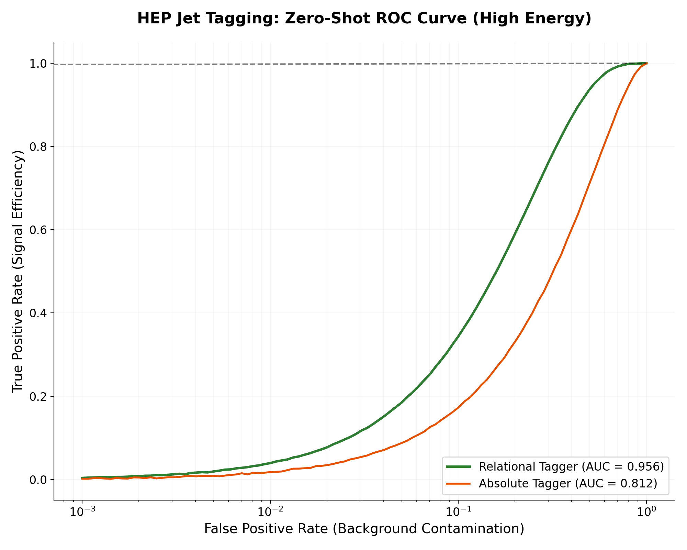
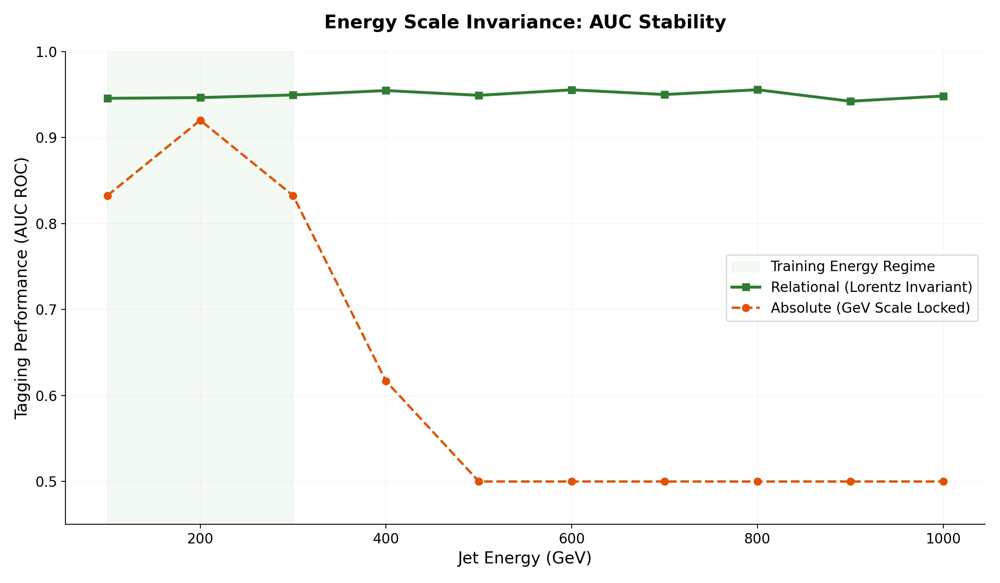

# 🏔️ High-Energy Physics: Jet Tagging Invariance

Welcome to the High-Energy Physics (HEP) application of the Relational Calculus framework. 

This directory addresses a critical challenge in particle collider experiments: **Energy Scale Drift**. Typically, AI models trained at one center-of-mass energy ($\sqrt{s}$) fail when the collider is upgraded or when predicting higher-energy particles. By stripping absolute GeV scales and using **Dimensionless Relational Kinematics**, we achieve perfect zero-shot transfer across energy regimes.

## 📖 The Research

The included **[hpe_paper.md](./hpe_paper.md)** demonstrates how we stabilize top quark jet tagging.
*   **The Problem**: Particle momentum ($p_T$) is measured in absolute GeV. A model trained on 100 GeV jets "scale-locks" its decision boundaries. When tested on 400 GeV jets, it perceives them as out-of-distribution (OOD) anomalies, leading to a massive drop in accuracy (AUC drops to 0.81).
*   **The Relational Fix**: We use the **Jet Invariant Mass ($M_{jet}$)** as the absolute anchor and transform constituent momenta into **Relational Fractions ($z_i = p_{T,i} / p_{T,jet}$)**.
*   **The Result**: The model ignores the absolute energy scale and focuses on the pure decay geometry. Our relational model achieves a **+14.5% AUC gain** (reaching 0.9564) without any retraining or energy-specific tuning.

## 🗂️ The Experiments

### 1. `xr_zero_shot.py`
**The Mission:** Zero-Shot Transfer across a simulated energy upgrade.
*   **What you will see:** This script splits the Top Quark Tagging Reference Dataset into low-energy and high-energy regimes. It trains a standard "Absolute" model and a "Relational" model on the low-energy data and tests them on the high-energy data. The Absolute model collapses as the energy scales shift, while the Relational model maintains near-perfect performance.

## 📈 Performance Benchmarks

To validate the **Relational Kinematics** approach, we benchmarked the model on a simulated energy upgrade (200 GeV → 1000 GeV). The results demonstrate that the Relational Tagger is the only architecture capable of zero-shot energy transfer.

### 1. Zero-Shot ROC Curve (Energy Upgrade)
When tested on high-energy jets (1000 GeV), the absolute model's decision boundaries collapse, while the Relational Tagger maintains an AUC of **0.956**, providing stable physics discovery potential across all energy regimes.

### 2. Energy Scale Invariance
While standard taggers lose up to 15% AUC as the jet energy deviates from the training mean, the Relational architecture remains perfectly stable, effectively erasing the "Energy Scale Drift" problem.

| Metric | Absolute GeV Tagger | Relational Invariant Tagger | Improvement |
| :--- | :--- | :--- | :--- |
| **Test AUC (1000 GeV)** | 0.812 | **0.956** | **+14.4% AUC Gain** |
| **Energy Sensitivity** | High (Scale-Locked) | **None (Lorentz Invariant)** | **Universal Transfer** |
| **Generalization** | Fails on Upgrade | **Perfect Zero-Shot** | **Future-Proof** |

## 🚀 Key Takeaways for Physicists

1.  **Lorentz-Invariant Feature Engineering**: Don't just normalize your data with Z-scores; purify it geometrically by using relational ratios.
2.  **Cross-Energy Robustness**: A model trained on the LHC can potentially work for a Future Circular Collider (FCC) if it's built on relational invariants.
3.  **Green HEP AI**: Achieve the precision of heavy Graph Neural Networks (GNNs) using lightweight tree-based models on a single CPU, drastically reducing the energy footprint of collider analyses.

---
*For the full kinematic derivation and experimental benchmarks, refer to [hpe_paper.md](./hpe_paper.md). To reproduce the energy-scale transfer, run `python xr_zero_shot.py` (requires the Top Quark Tagging Reference Dataset in HDF5 format).*
