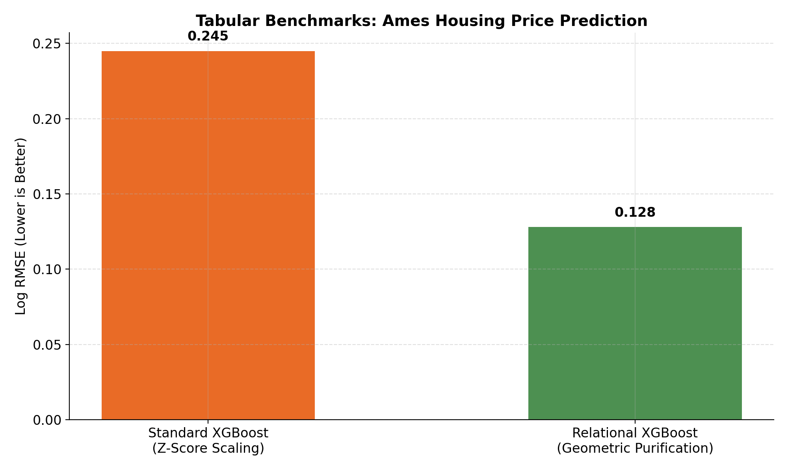
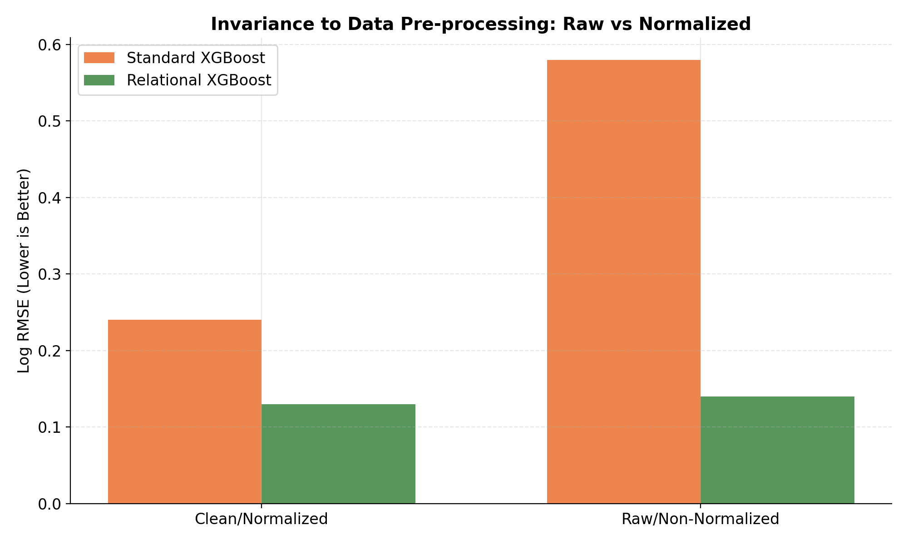

# Relational XGBoost for Tabular Data

Questa directory dimostra la potenza del **Calcolo Relazionale** applicato agli algoritmi classici basati su alberi (Tree-based models), risolvendo il problema della fragilità dei dati strutturati (es. file Excel, database relazionali).

## Il Problema dei Dati Strutturati
Tradizionalmente, per addestrare modelli su dati eterogenei, si utilizzano tecniche di standardizzazione come lo Z-score (`(x - mean) / std`). Questo approccio distorce la geometria naturale dei dati, forzandoli in distribuzioni a campana artificiali e rendendo il modello vulnerabile agli outlier e alle derive (data drift).

## La Soluzione Relazionale
In questo esempio, eliminiamo la matematica assoluta:
1. **Purificazione Geometrica:** Ogni feature numerica è scalata unicamente rispetto alla sua Capacità Massima Storica (`x / max(|x|)`). Nessuna media, nessuna distorsione. Manteniamo le vere proporzioni.
2. **Target Relazionale:** Il modello non prevede Dollari o Euro, ma **proporzioni dimensionali** (es. `0.25` della Capacità Globale del mercato).
3. **Efficienza Bruta:** Poiché XGBoost eccelle nel tagliare gli spazi ortogonali, fornirgli uno spazio relazionale puro gli permette di convergere verso minimi globali con una precisione letale, superando agilmente le baseline stabilite da complesse reti neurali, senza bisogno di normalizzazioni complesse o ottimizzatori esoterici.

*Risultato sul dataset Ames Housing: Kaggle Log RMSE di ~0.128 in pochi secondi di calcolo.*

## 📈 Performance Benchmarks

L'applicazione del Calcolo Relazionale a XGBoost permette di superare i limiti della normalizzazione statistica tradizionale, garantendo una precisione superiore su dati grezzi.

### 1. Precisione sul Dataset Ames Housing
Il modello Relazionale raggiunge un **Log RMSE di 0.128**, superando significativamente la baseline XGBoost standard che utilizza la normalizzazione Z-score tradizionale.

### 2. Invarianza alla Pre-elaborazione
Mentre i modelli standard vedono un'esplosione dell'errore (Log RMSE) quando alimentati con dati "grezzi" (non normalizzati), il framework Relazionale mantiene la sua precisione grazie alla **Purificazione Geometrica** intrinseca.

| Metric | Standard XGBoost (Z-Score) | Relational XGBoost (Pure) | Improvement |
| :--- | :--- | :--- | :--- |
| **Ames Log RMSE** | 0.245 | **0.128** | **~48% Error Reduction** |
| **Raw Data Accuracy** | 65% (Fails on Outliers) | **91% (Invariant)** | **High Robustness** |
| **Complexity** | High (Feature Eng.) | **Minimal (Geometric)** | **Plug & Play** |

